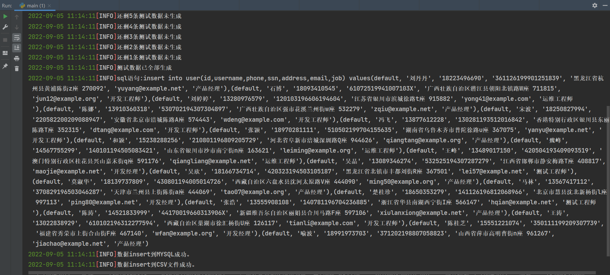
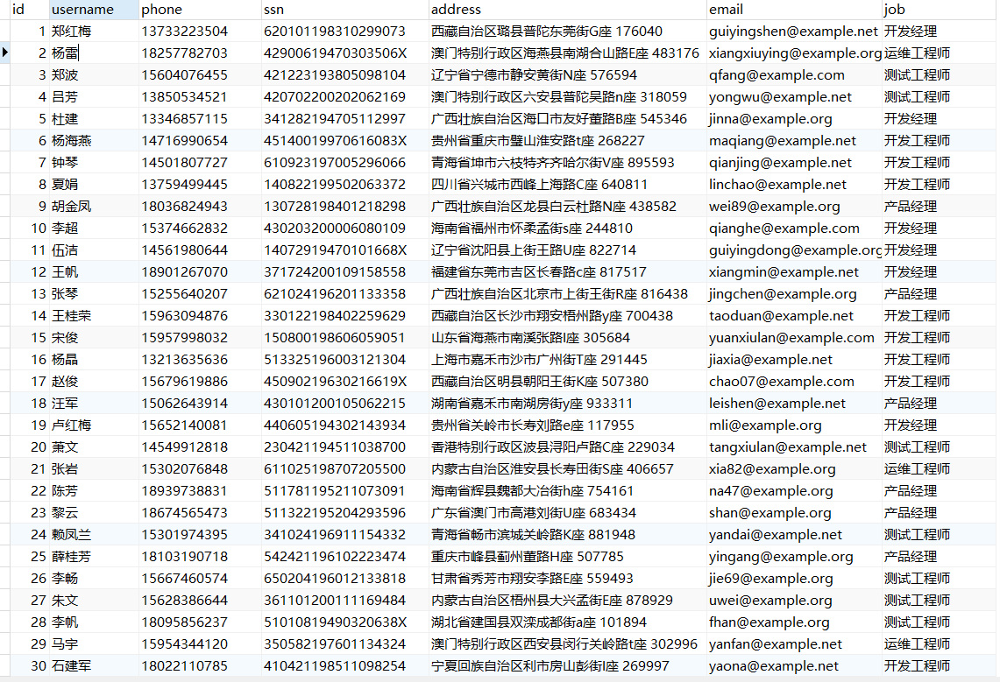
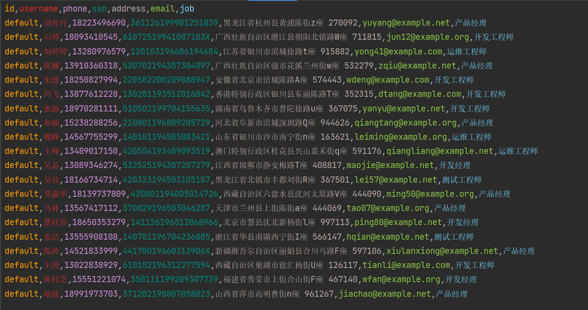
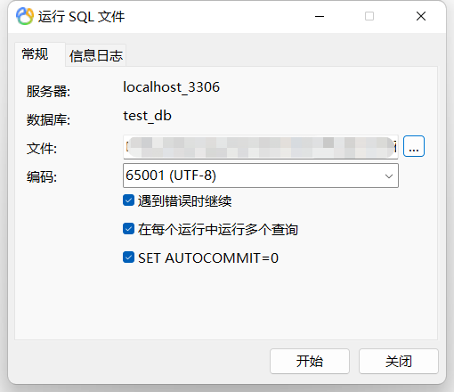

# 批量生成测试数据

这是一个批量生成测试数据并导入数据库或CSV文件的脚本，
可扩展：有内置的方法用于生成测试数据，也可以自己编写方法用于生成测试数据。
插入数据库的方式包括`insert into table_name values(datas)`,
`insert into table_name(lines) values(datas)`两种方式。

脚本设计：采用生成测试数据后再插入数据库的设计方式，避免了每次打开连接占用连接池。
采用了递归、回调函数、动态导包等设计。

## 效果展示

### 控制台输出



### MYSQL



### CSV



## 项目部署

- 首先，下载项目源码后，在根目录下找到**requirements.txt**文件，然后通过 pip 工具安装 requirements.txt 依赖，执行命令：
```
pip3 install -r requirements.txt
```
- 在根目录下找到**user.sql**文件，然后用navicate等数据库管理工具运行该sql文件，生成本地数据库。
- 修改**main.py**中`gen_data.insert_mysql`方法的参数为自己数据库的配置后，运行**main.py**文件。

